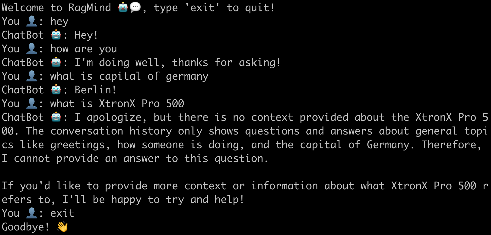
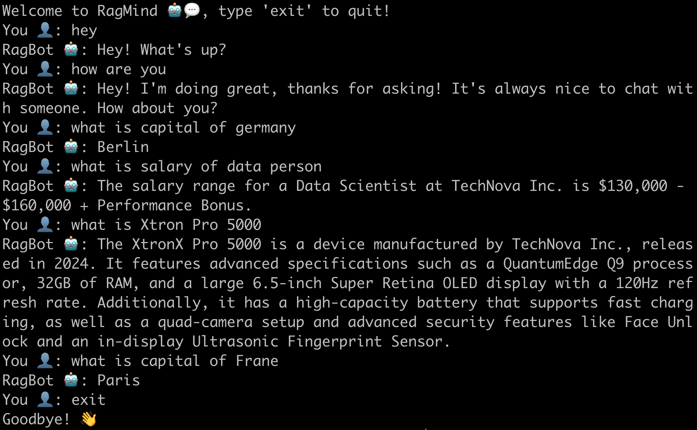
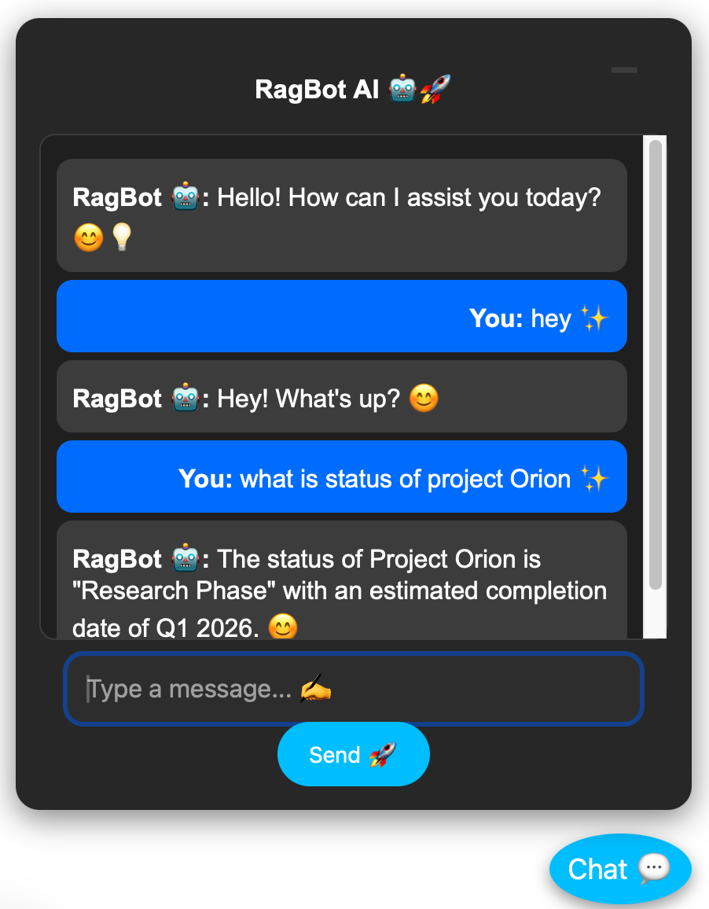
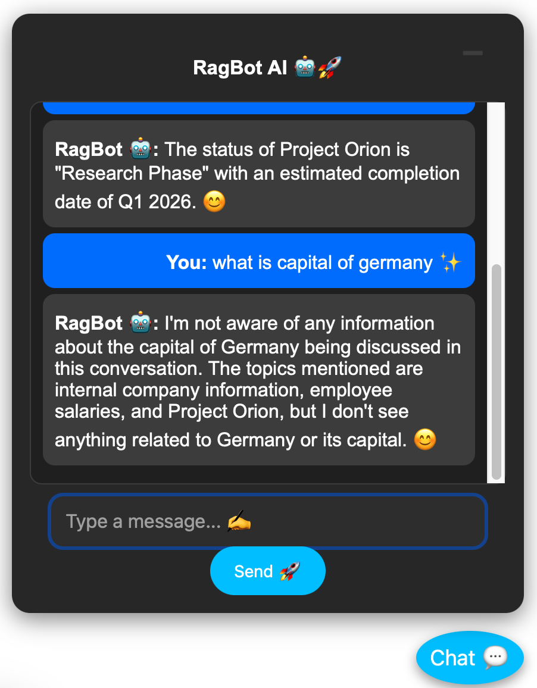

# RagBot AI Chat 🤖💬  

RagBot is an advanced **Retrieval-Augmented Generation (RAG)** chatbot that integrates **Ollama** and **LangChain** to provide intelligent, data-driven conversations. It can work with or without internal company data, making it a versatile AI assistant. The chatbot is accessible via a web browser and runs on a **FastAPI** or **Flask** backend. 🚀

## 🌟 Features  

- **Ollama Integration** 🏗️: Easily switch between different AI models.  
- **Retrieval-Augmented Generation (RAG)** 📚: Uses pre-existing company data for enhanced responses.  
- **Web Deployment** 🌐: Simple HTML/JS frontend for easy interaction and modify the chatbot UI with ease.
- **Flask Support** 🔥: For backend framework.

## 📂 Project Structure  

```
.
├── ChatBot.py                # Core chatbot logic (without company data)
├── RagBot.py                 # RAG-enhanced chatbot (with company data)
├── Internal_Data.txt         # Example company data (FAKE DATA)
├── app.py                    # Flask server
├── requirements.txt          # Python dependencies
├── set_environment.sh        # Script to set up the environment
├── templates
│   └── index.html            # Web UI for chatbot
├── img                       # Images for documentation
│   ├── ChatBot.png           # Basic chatbot example
│   ├── RagBot.png            # RAG-powered chatbot example
│   ├── WebBot1.png           # Web UI example 1
│   ├── WebBot2.png           # Web UI example 2
```

## 🚀 Getting Started  

### 1️⃣ Set Up Environment (Recommended)  

To create a virtual environment and install dependencies, run:  

```bash
bash set_environment.sh
```

### 2️⃣ Install Ollama 🦙  

Ollama is required for running AI models locally. Install it using:  

```bash
curl -fsSL https://ollama.ai/install.sh | sh
```

_For Windows users, download from [Ollama's official site](https://ollama.ai), even if there is issue in any other OS, please refer to their website._

### 3️⃣ Download Llama 3  

Pull the **Llama 3** model into Ollama:  

```bash
ollama pull llama3
```

### 4️⃣ Serve Ollama

Manually start and serve the model, using the following command:

```bash
ollama serve
```

### 5️⃣ Run the Chatbot  

Simply start the chatbot server:  

```bash
python app.py
```

Then, open your browser and visit:  

```
http://127.0.0.1:8000/
```

**There is a small chat button, on the bottom right. Click on it and begin chatting with the RagBot 💬.**

If you want to test the bots, without the webbrowser, you can run either `python ChatBot.py` or `python RagBot.py` in your terminal to chat with the bot without and with RAG enabled respectively.

## 🧠 **Gen AI Tools Used**

### 🔹 LangChain  

LangChain provides an easy way to build AI-powered applications by connecting models, data sources, and logic. It allows RagBot to:

- Retrieve relevant data efficiently 🗄️  
- Use memory to maintain conversational context 🧠  
- Seamlessly integrate with multiple AI models ⚙️  

### 🔹 Ollama  

Ollama enables running **large language models (LLMs)** locally with ease. Here are some of the best options:  

| Model Name                  | Use Case 🛠️                                        |  
|-----------------------------|--------------------------------------------------|  
| **LLaMA 3** 🦙              | General-purpose chatbot, reasoning, and Q&A     |  
| **Mistral 7B** 🌪️          | Lightweight, optimized for fast responses      |  
| **Gemini Nano** ✨          | Multimodal AI (text + images) for creative tasks |  
| **Code Llama** 💻          | Code generation and programming assistance      |  
| **Phi-2** 🧠               | Small, efficient model for lightweight apps     |  
| **Custom Fine-Tuned Models** 🔬 | Tailored to your business data and needs   |  

### 🔹 LLaMA 3

A large language model by Meta, focused on efficient, open-source NLP tasks like text generation and question-answering.

### 🔹 FAISS

A library by Meta for fast, efficient similarity search and clustering of high-dimensional vectors, commonly used in search and recommendation systems.

### 🔹 Sentence-Transformers/all-MiniLM-L6-v2

A lightweight model for generating sentence embeddings, optimized for fast and efficient semantic text comparison.

### 🏗️ **How We Use Ollama in RAG**  

In our **Retrieval-Augmented Generation (RAG) approach**, we use the following:  

- **Embedding Model**: `"sentence-transformers/all-MiniLM-L6-v2"`  
- **RAG Pipeline**: Uses `Internal_Data.txt` for contextual responses  
- **LLM**: Runs on Ollama with **LLaMA 3**

## 🖼️ Sample Outputs  

### 🔹 Basic Chatbot (No Company Data)  

  

### 🔹 RAG-Powered Chatbot (With Company Data)  

  

### 🔹 Web Deployment Example  

  
  

## 👨‍💻 Contributing  

Want to improve RagBot? Follow these steps:  

1. **Fork the repo** 🍴  
2. **Create a new branch** 🛠️ (`git checkout -b feature-name`)
3. **Make your changes** 💡  
4. **Submit a Pull Request (PR)** 🔥  

## ⚠️ Disclaimer  

📢 **All data used in this project is FAKE and for demonstration purposes only.**  

## 📬 Contact Me

If you have any questions or run into any issues, feel free to reach out to me on [LinkedIn](https://www.linkedin.com/in/adnan-karol-aa1666179/). I'm here to help! 😊
